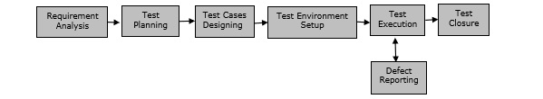
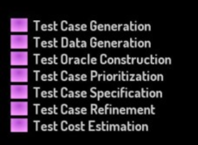
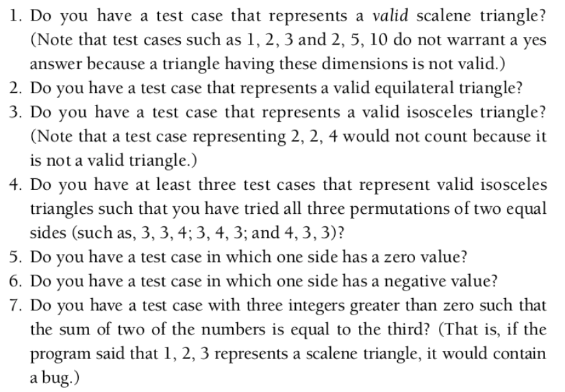
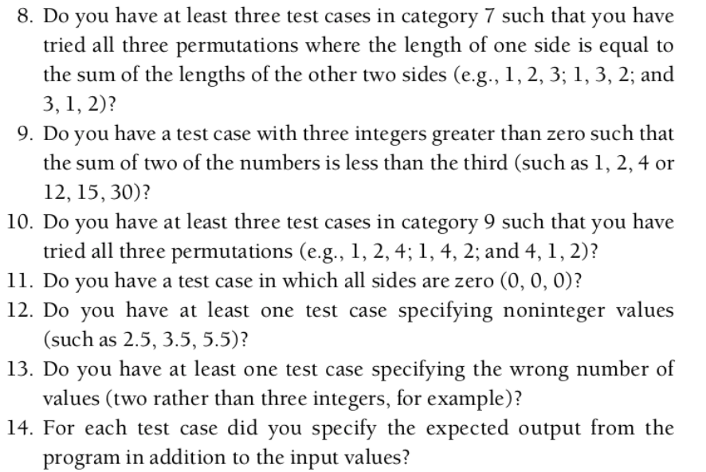
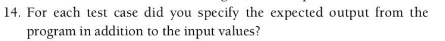
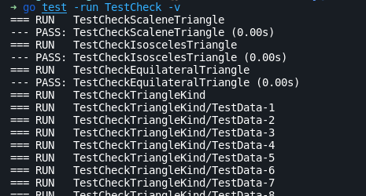
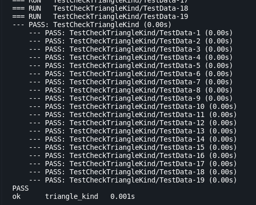
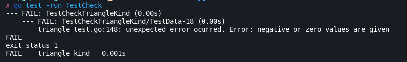
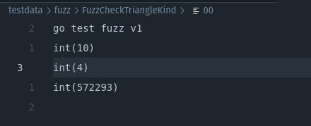

[comment]: # (THEME = moon)
[comment]: # (CODE_THEME = atom-one-dark)
[comment]: # (Pass optional settings to reveal.js:)
[comment]: # (controls: true)
[comment]: # (keyboard: true)
[comment]: # (markdown: { smartypants: true })
[comment]: # (hash: false)
[comment]: # (respondToHashChanges: false)
[comment]: # (Other settings are documented at https://revealjs.com/config/)

## Testing (from a POV)

Anthony Aróstegui (anargu)

GH: anargu

Twitter: @anargu101

[comment]: # (!!!)

## Bio

+5 años programando (aprox) haciendo y deshaciendo en:

  - Empresa grande / Start Ups
  - Proyectos de investigación
  - Proyectos personales
  - Front / Back y un poco de AI

---

## Idea y objetivos de estas sesiones 

- Rescatar la relevancia del testing/Quality Assurance (QA)
- Disponibilizar herramientas de testing en diferentes lenguajes
- Porqué el integrar testing en el ciclo de desarrollo de software beneficia
- Tener un entendimiento general de cómo se trabaja el testing/QA en otros entornos
- Entender Test-Driven Development TDD

---

## Importancia del testing/QA

- Se ven casos de errores de sistema. (Crashes o servicios indisponibles de
  incluso empresas  grandes)
- Programas suelen incluir vulnerabilidades
- La forma de pensar de algunos desarroladores. (Spoiler: yo también, en mis inicios)

---

## Importancia del testing/QA

- "Si bien el desarrollo de software es el proceso de meter bugs. El testing es
  el proceso de quitarlos"
- [https://github.com/kelseyhightower/nocode](https://github.com/kelseyhightower/nocode)

---

## Importancia del testing/QA

"Mi programa funciona"

---

## Importancia del testing/QA

"Mi programa funciona"
(Sí... pero parece ser que lo entendemos como un proceso finito)

---

## Importancia del testing/QA

"The purpose of testing is to show that a program performs its intended functions correctly."
(Bad definition)

---

## Importancia del testing/QA

Otra Perspectiva: "Este software funcioná hasta tal alcance. Con el nivel de prueba a este nivel"

Idea "Desarrollador completo"

---

## Importancia del testing/QA

- Tiene 2 cuestiones: Psicológico y Económico

---

## Importancia del testing / Económico

- No se puede llegar a la perfección en un programa/código.
- Aunque se tenga una cantidad enorme de tests, no se puede confirmar que el
  programa esté libre de bugs/vulnerabilidades

---

## Testing: Definición

- No hay una concreta.
- (Art of testing) Testing is the process of executing a program with the intent of find-
ing errors.

---

## Testing: Definición

- Software testing is an investigation conducted to provide stakeholders with information about the quality of the software product or system under test (SUT).
- A test as conducted in the practice of software testing is → An activity in which certain code is executed under certain conditions, certain effects of the execution are observed, and an evaluation of the observed effects is made.

---

## Testing en Empresas

- Software Testing Life Cycle (STLC)

---

## Testing en Empresas

- Tests consisten en 30-40% del total del esfuerzo en un proyecto
- Tests consisten en 50% del total del costo en un proyecto

---

## Testing - Técnicas

- Black Box Testing : function-centric testing
- White Box Testing: Tests logic of code. internal code
- Grey Box Testing

---

## Testing - Tipos

- Manual Testing
- Automated Testing

---

## Testing - Niveles/Scope

- Unit Test
- Integration Test
- System Test / End 2 End (E2E) Test

---

## Testing - Otros tipos

- Regression Tests
- Stress Tests
- Smoke Tests
- A/B Testing (?)

---

## Testing - Development techniques

- TDD
- BDD

---

# Testing en Golang

---

## Caso del Triángulo 

Dados 3 lados de un triángulo determinar si el triángulo es isósceles, equilátero o escaleno.

---

## Caso del Triángulo

---

## Caso del Triángulo

---

## Caso del Triángulo

---

# Herramientas de tests en Golang 

---

## Testing en Golang - Setup unit tests

### herramienta de testing golang

    go help test

    // prepares to execute all tests found in current dir and execute the
    // binary test
    // (local directory mode)
    go test 

    // (listing packages mode)
    // matches packages
    go test ./...

    go test .

    go test math

    // make it verbose with "-v" arg
    // disable test caching with "-count=1" arg
    // pass arguments to the program to be tested with "-args" 

--- 

## herramienta de testing golang

- crea un archivo que termine en _test.go. Por ejemplo multiply_test.go

---

## Paquete testing de Golang

    package mypackage

    import "testing"

    func TestAabbcc (t *testing.T) {
      d, err := DoSomething(a, b)

      if err != nil {
        t.Fatalf("test case threw an unexpected error %v\n", err)
      }
    }

---

## Output de go test

---

## Output de go test

---

## Output de go test

---

## Output de go test

---

# Go Fuzz Test 

---

## Go Fuzz Test - Bio

- Inicios de 2021 se propone integrar fuzz testing en Go
- Se originó a partir del éxito del paquete go-fuzz

---

## Go Fuzz Test - Features

- Se puede componer de una data (seed) inicial
- Se compone de un mecanismo generador de nueva data de entrada (input data) del cual se testea el fuzz target (La unidad a testear)
- Funciona cómo un test (La unidad de test funciona como un test)
- Los tests corren de forma paralela por lo que se debe preveer que no haya un estado global que los tests editen.

---

## Go Fuzz Test - Comentarios

- Parece ser un brute-force test.
- Se usa sobretodo en aplicaciones de seguridad y búsqueda/descubrimiento de bugs (en proyectos de O.S.)

---

## Go Fuzz Test - Drawbacks

- No considerarlo como un reemplazo a las otras alternativas (unit test y otros).
    - No presenta data de expected porque se la data se genera de manera randomized.
- Pueden ser computacionalmente costosos por la ejecución masiva de tests en CI/CD.
    - Spoiler: Ya hay soluciones que ofrecen este servicio → https://fuzzbuzz.io/

---

## Go Fuzz Test - How to

Cargar data (seed)  → 2 formas:
- f.Add(...args)
- Colocar en testdata/fuzz/<FuzzTestName>/ archivos de texto que serían las
  unidades de prueba. Estructura:

---

## Go Fuzz Test - Output

