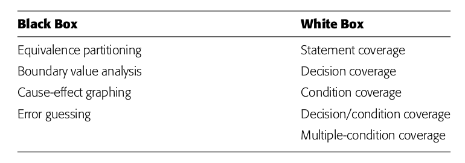

[comment]: # (THEME = moon)
[comment]: # (CODE_THEME = atom-one-dark)
[comment]: # (Pass optional settings to reveal.js:)
[comment]: # (controls: true)
[comment]: # (keyboard: true)
[comment]: # (markdown: { smartypants: true })
[comment]: # (hash: false)
[comment]: # (respondToHashChanges: false)
[comment]: # (Other settings are documented at https://revealjs.com/config/)

## Testing (from a POV)

Anthony Aróstegui (anargu)

GH: anargu

Twitter: @anargu101

[comment]: # (!!!)

## Bio

+5 años programando (aprox) haciendo y deshaciendo en:

  - Empresa grande / Start Ups
  - Proyectos de investigación
  - Proyectos personales
  - Front / Back y un poco de AI

---

## Testing - Técnicas

- Black Box Testing : function-centric testing
- White Box Testing: Tests logic of code. internal code
- Grey Box Testing: Mix of Black and White Box Testing

---

## Testing - Niveles/Scope

- Unit Test
- Integration Test
- System Test / End 2 End (E2E) Test

---

## Testing - Otros tipos

- Regression Tests
- Stress Tests
- Smoke Tests
- A/B Testing (?)

---

## Testing - Development techniques

- TDD
- BDD

---

## Test Case Design

complete testing is impossible

Effective test cases → A Thoughtfull process

---

## Test Case Design

---

## Test Driven Development

- Methodology
- A way of coding

---

## Test Driven Development - Benefits

- Write Testable Code
- Write Modular Code
- Write Well-designed Code

---

## Test Driven Development - Positive Consequences

- If the defect density can be reduced enough, then quality assurance (QA) can shift from reactive work to proactive work.
- If the number of nasty surprises can be reduced enough, then project managers can estimate accurately enough to involve real customers in daily development.
- If the topics of technical conversations can be made clear enough, then software engineers can work in minute-by-minute collaboration instead of daily or weekly collaboration.
- Again, if the defect density can be reduced enough, then we can have shippable software with new

---

## Test Driven Development - Cons

- Not easy to execute "perfectly"
- Requires practice
- Myths:
  - Not easy to refactor code/tests
  - Spend more time on tests
  - It is not only focused on "Unit Tests"
- It is like a skill: Need to practice a lot

---

## Test Driven Development - Cons

Security software and concurrency

TDD is insufficient to mechanically demonstrate that the goals of the software have been met.

Subtle concurrency problems can't be reliably duplicated by running the code.

---

## Test Driven Development Mantra - How?

1. Red
2. Green
3. Refactor

---

## Test Driven Development Mantra - How?

"Did I just break something else with that change?" Figure 25.1 shows the dynamic at work.
With automated tests, when I start to feel stress, I run the tests. Tests are the
Programmer's Stone, transmuting fear into boredom. "No, I didn't break anything. The tests
are all still green." The more stress I feel, the more I run the tests. Running the tests
immediately gives me a good feeling and reduces the number of errors I make, which
further reduces the stress I feel.

---

## eXtreme Programming (XP)

- Born in 1999
- proposed by Kent Beck
- Story -> (link video)
- 2nd edition -> 2004

---

## eXtreme Programming

Valor <- Principio <- Interfaces

---

## eXtreme Programming - Prácticas

- Equipo colocalizado
- Equipo multidisciplinar ()
- Espacio útil e informativo
- Trabajo con impacto
- Pair programming
- Historias de usuario (formato)
- Ciclo semanal de planificación
- Ciclo trimestral de planificación
- Tiempo de "no ocupación" (Por qué es importante)
- Integración contínua
- Los tests primero
- Diseño incremental

